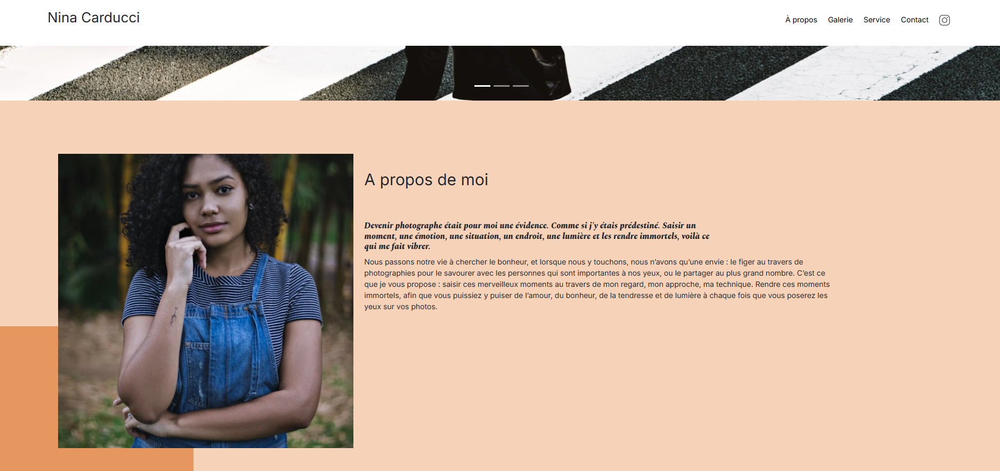

Site web de Nina Carducci

Ce dépôt correspond au projet 4 de la formation Développeur Web d'OpenClassrooms. 

Il consiste à débugger et optimiser le site web de cette photographe.

Les objectifs étaient : 
- optimiser les performances d'un site web
- débugger un site web grâce aux Chrome DevTools
- Rédiger un cahier de recette pour tester un site

La technologie utilisée pour ce projet : 
- Google Lighthouse
- GTmetrix
- Schéma.org
- Google Rich Snippet
- Opengraph
- Wave

J'ai validé ce projet le 2 juillet 2024.

Les points forts de mes livrables : 
- images optimisées et au format webp
- balise meta description présente
- Rich snippet (microdonnées) ajouté pour la localisation du photographe
- balises meta pour réseaux sociaux présentes
- code JavaScript et CSS minifiés
- balise title pertinente ajoutée dans le head de la page HTML
- tous les attributs alt sont présents pour les images
- les différents titres de la page sont structurés et dans un ordre logique
- le bugs présents au niveau du carrousel sont corrigés
- les contrastes des catégories sont optimisés pour une meilleure accessibilité
- les 4 indicateurs lighthouse sont à plus de 90 %

Mes difficultés : 
- reprendre un code existant fait avec des technologies que je ne connaissais pas lorsque j'ai réalisé ce projet. 

